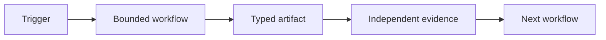

Job descriptions and agent platforms often describe a **seat**: a role with tools, memory, and handoffs. The durable abstraction is a **workflow contract**: the same six fields, but each field answers to an exit condition and evidence, not a persona.

An agent, script, Worker, cron job, or human may execute the contract.

## Seat field → workflow contract

| Seat field | Workflow-level contract |
| --- | --- |
| **Job** | One measurable outcome, exit condition, and refusal boundary |
| **Connections** | Injected tools, accounts, data scope, and permissions |
| **Computer** | Runtime plus external state reachable from that runtime |
| **Routines** | Clock or event trigger and expected output per invocation |
| **Skills** | Versioned method: tests first, then script, runbook, or thin skill |
| **Handoffs** | Receiver, typed artifact, state, evidence, and escalation path |

## One-line form

> Trigger → bounded workflow → typed artifact → independent evidence → next workflow

## When to add a new seat

Add a new executor only when a real boundary exists:

- Different tools or permissions
- Different memory scope
- Different evaluation

Otherwise add the method to the existing workflow.

## Example (abbreviated)

**Job:** Publish weekly marketing pulse for one client; exit when PDF is in Shared Drive and numbers reconcile to source.

**Connections:** Analytics read-only, reporting Shared Drive write, client config file.

**Computer:** Scheduled runner with access to metric store and grader.

**Routines:** Every Monday 06:00 local; output is one PDF or a blocked run with findings.

**Skills:** Window selection, fetch-missing, grade, render, deliver, each a named step with tests.

**Handoffs:** Human reviews only when grader fails or override requested; escalation is a ticket, not a chat.

## Related

- [Workflow is the unit](/concepts/workflow-is-the-unit/)
- [Evidence not trust](/concepts/evidence-not-trust/)
- [Phase 2: Design](/phase-2/what-is-design/)
- [Downloads: workflow contract template](/downloads/)
