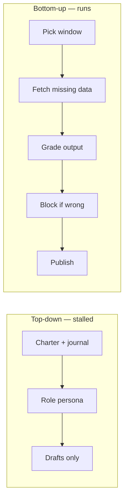

When you build AI into operations, the durable unit is a **workflow**: a bounded process with a named outcome and an exit condition. It is not a **role** — an "SEO agent" or "analyst bot" loaded with context, a charter, and a growing rule list.

Build the workflow units a role would need, and the role becomes a thin routing layer on top — if you need it at all.

## Why the distinction matters

A workflow has an exit condition. A role does not. Everything else follows:

| Property | Workflow | Role |
| --- | --- | --- |
| Testable | Yes — it reached the outcome or it did not | No — nothing says when it is done |
| Costable | Yes — cost attaches to a bounded unit | No — an unbounded session against a meter |
| Diagnosable | Yes — failure names its own step | No — drift with no red signal |
| Stateless per run | Yes — carries its definition | No — carries a compacting log |
| Transferable | A definition can be handed over | Judgment lives in a prompt in someone's head |

The role-first approach is what most "build your own AI agent" guides teach: describe the role, give it context, add a rule each time it goes wrong. It stalls the same way every time. The charter grows. The context grows. Judgment ends up in a prompt where it drifts and cannot be tested.

## The log-vs-profile diagnostic

When someone insists a role is necessary, ask:

> Is anything in this bot's log that is not in its profile?

- **No** — the "role" is a UI skin over a workflow. The bot is disposable.
- **Yes** — you are carrying unmanaged state that degrades silently. Only worth it when accumulated history genuinely helps.

## Build capabilities first

The fastest path to a working SEO agent is to stop building the SEO agent and build the SEO capabilities.

**Top-down:** a standing agent with charter, journal, and re-orientation on every wake. It produces drafts and rarely goes further. Keeping it oriented is the work.

**Bottom-up:** a weekly report with no persona anywhere. Small steps — pick the window, fetch what is missing, grade, publish — with a gate that blocks delivery when numbers do not reconcile. Nobody described an analyst to get it.

The report behaves more like an analyst than the agent does, and nobody tried to make it one.

## Honest caveat

This ordering — capabilities before persona — is a working hypothesis, not a proven law. One bottom-up success and one top-down stall in different domains is evidence, not a result. The falsifier: build the units the way the report is built, write the agent over them, and measure whether it stays short and stable.

## How to use this

- **When asked to build an agent:** define the outcome and exit condition first. Do not start with a charter.
- **When a role feels necessary:** run the log-vs-profile diagnostic.
- **Defer the conductor** until routing between workflows is the actual friction.

## Related

- [Three senses of agent](/concepts/three-senses-of-agent/)
- [Gate 0](/concepts/gate-zero/)
- [Module 1 — Reframe](/course/module-1-reframe/)
