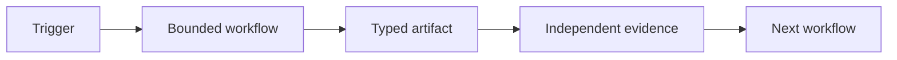
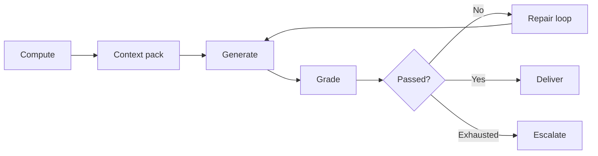
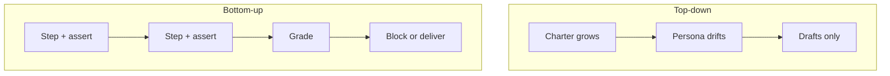

## What is the Design phase?

Phase 1 changed the question from "which chatbot?" to "which **bounded workflow**?" Phase 2 answers: **which workflow first, and what does the contract look like?**

Design is not wireframes or tool selection. It is naming one repeatable unit of work with:

- A measurable outcome
- An exit condition
- Refusal boundaries (when it must block)
- Triggers, connections, evidence

You are not building yet. You are making the unit **legible** enough that a builder, human or team, could implement it without reading your mind.


### Success at end of Phase 2

One workflow contract on paper that a colleague can review without you in the room, and they can tell when it succeeded or refused.

---

## The shape test

The enablement question is not "what feels painful?" It is: **where does expert time go to finding and verifying rather than deciding?**

Three signals together predict a high-value AI workflow better than pain alone:

| Signal | What it means |
| --- | --- |
| **Fragmented truth** | The answer exists but lives in six places: analytics, sheets, inbox, someone's head |
| **Expensive to be wrong** | Compliance, client trust, money on the line |
| **Lookup and verify dominate** | Expert hours spent reconciling, not inventing |

### Examples

**Legal / policy research:** Model given only case snippets invents statutory text. Fixing the **corpus**, not the model, fixed output.

**Warranty lookup across stores:** Fragmented source, hours looking things up, costly errors, classic shape.

**Weekly client reporting:** Numbers must reconcile to GA4; wrong report is worse than no report.

### What this is not

- "Write my emails faster", often generative without a grader; half-built
- "Summarize this meeting", low cost of being wrong; hard to measure ROI
- Tool-first ideas with no named outcome

### Corollary for enterprise

Inside an org the corpus is **private, messy, permissioned**. The binding constraint is often **data access and politics**, not model intelligence. Most "we tried AI and it failed" stories are corpus problems wearing model problems' clothes.

### Discussion

Where on your team does someone **verify** more than **decide**? Start the workflow list there.

---

## Seat contract

Job descriptions describe a **seat**: role, tools, memory, handoffs. The durable abstraction is a **workflow contract**: same six fields, but each answers to an exit condition and evidence.

An agent, script, Worker, cron, or human may execute the contract.

### Seat field → workflow contract

| Seat field | Workflow contract |
| --- | --- |
| **Job** | One measurable outcome, exit condition, refusal boundary |
| **Connections** | Tools, accounts, data scope, permissions |
| **Computer** | Runtime + external state it can reach |
| **Routines** | Trigger and expected output per run |
| **Skills** | Versioned method: tests, script, runbook, thin skill |
| **Handoffs** | Receiver, typed artifact, evidence, escalation |

### One-line chain



> Trigger → bounded workflow → typed artifact → independent evidence → next workflow

### Worked example: weekly marketing pulse

| Field | Contract |
| --- | --- |
| Job | PDF in Shared Drive; numbers reconcile |
| Connections | Analytics read-only, Drive write, client config |
| Computer | Scheduled runner + metric store + grader |
| Routines | Monday 06:00; output PDF or blocked run |
| Skills | Window, fetch, grade, render, deliver: each named |
| Handoffs | Human only on grader fail; ticket not chat |

### Rule

Add a new executor only when tools, memory, permissions, or evaluation ** genuinely differ**. Otherwise extend the existing workflow.

:::tip[Reference]
[Seat contract (Reference)](/concepts/seat-contract/)
:::

---

## Deterministic core and generative judgment

Every workflow that uses a model for prose or judgment splits into two graded halves:

| Half | Graded by | Examples |
| --- | --- | --- |
| **Deterministic core** | `assert`, code | Numbers reconcile, file exists, schema valid, window correct |
| **Generative judgment** | Rubric + gold examples | Tone, prioritization, narrative, tradeoff framing |

A generate step with **no grader and no repair loop** is half-built, and half-built the same way everywhere.

### Full shape



**Repair loop:** grader findings become the next prompt's input, capped tries, fail-closed. That separates "prompt harder" from a system.

### Portable contract

What travels between implementations is not shared code. It is the pattern:

```json
{ "passed": false, "findings": ["Sessions 12,450 ≠ read-back 11,902"] }
```

Findings feed the loop. Self-reported "I'm done" does not.

### Code vs model line

Push every checkable part into code first. What remains after that subtraction is the actual taste question, usually smaller than the rubric implied.

If the whole rubric survives as code, you have a script, whatever the process felt like.

---

## Bottom-up vs top-down

Two directions for the same ambition ("an analyst agent," "an SEO agent"):

### Top-down: persona first

- Charter, journal, re-orient every session
- Produces drafts; rarely reaches delivery
- Keeping the agent oriented **is** the work
- Every failure becomes a new rule in the prompt

### Bottom-up: workflow first

- Chain of small steps, each with acceptance checks
- No persona in the architecture
- Gate refuses delivery when evidence fails
- Nobody described a role to get role-like output



### Case study

The [weekly report workflow](/case-study/weekly-report/) is bottom-up: scheduled chain, grader, no analyst persona. Open the [workflow diagram](/case-studies/class-email.html) during this lesson.

Contrast: a standing SEO agent with charter produces drafts and stalls. The report **refuses** when wrong. It behaves more like an analyst without naming one.

### Honest caveat

Capabilities-before-persona is a **working hypothesis**. Test on your domain: build one unit with a grader, then see how thin the layer on top needs to be.

:::note[Facilitator]
Screen-share the case study diagram here. Ask: where would a chatbot version fail silently?
:::

---

## Activity

Ready for the hands-on block? [Start activity: draft a workflow contract →](/phase-2-design/activity-contract/)

