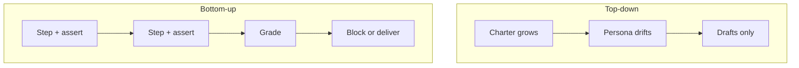

Two directions for the same ambition ("an analyst agent," "an SEO agent"):

## Top-down — persona first

- Charter, journal, re-orient every session
- Produces drafts; rarely reaches delivery
- Keeping the agent oriented **is** the work
- Every failure becomes a new rule in the prompt

## Bottom-up — workflow first

- Chain of small steps, each with acceptance checks
- No persona in the architecture
- Gate refuses delivery when evidence fails
- Nobody described a role to get role-like output

## Case study

The [weekly report workflow](/case-study/weekly-report/) is bottom-up: scheduled chain, grader, no analyst persona. Open the [workflow diagram](/case-studies/class-email.html) during this lesson.

Contrast: a standing SEO agent with charter produces drafts and stalls. The report **refuses** when wrong — closer to analyst behavior without naming one.

## Honest caveat

Capabilities-before-persona is a **working hypothesis**. Test on your domain: build one unit with a grader, then see how thin the layer on top needs to be.

:::note[Facilitator]
Screen-share the case study diagram here. Ask: where would a chatbot version fail silently?
:::

**Next:** [Activity — draft a contract](/phase-2/activity-contract/)
