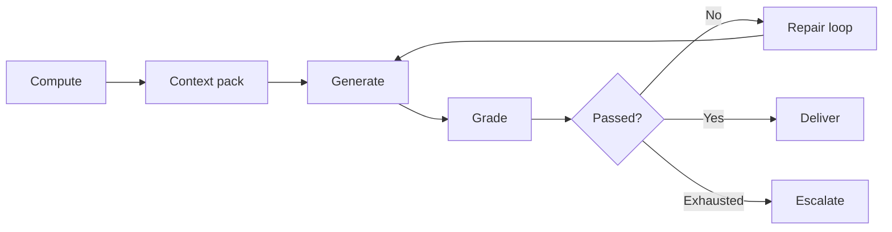

Every workflow that uses a model for prose or judgment splits into two graded halves:

| Half | Graded by | Examples |
| --- | --- | --- |
| **Deterministic core** | `assert`, code | Numbers reconcile, file exists, schema valid, window correct |
| **Generative judgment** | Rubric + gold examples | Tone, prioritization, narrative, tradeoff framing |

A generate step with **no grader and no repair loop** is half-built, and half-built the same way everywhere.

## Full shape



**Repair loop:** grader findings become the next prompt's input, capped tries, fail-closed. That separates "prompt harder" from a system.

## Portable contract

What travels between implementations is not shared code. It is the pattern:

```json
{ "passed": false, "findings": ["Sessions 12,450 ≠ read-back 11,902"] }
```

Findings feed the loop. Self-reported "I'm done" does not.

## Code vs model line

Push every checkable part into code first. What remains after that subtraction is the actual taste question, usually smaller than the rubric implied.

If the whole rubric survives as code, you have a script, whatever the process felt like.

