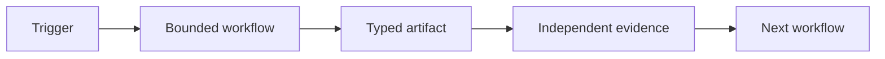

Job descriptions describe a **seat**: role, tools, memory, handoffs. The durable abstraction is a **workflow contract** — same six fields, but each answers to an exit condition and evidence.

An agent, script, Worker, cron, or human may execute the contract.

## Seat field → workflow contract

| Seat field | Workflow contract |
| --- | --- |
| **Job** | One measurable outcome, exit condition, refusal boundary |
| **Connections** | Tools, accounts, data scope, permissions |
| **Computer** | Runtime + external state it can reach |
| **Routines** | Trigger and expected output per run |
| **Skills** | Versioned method: tests, script, runbook, thin skill |
| **Handoffs** | Receiver, typed artifact, evidence, escalation |

## One-line chain

> Trigger → bounded workflow → typed artifact → independent evidence → next workflow

## Worked example — weekly marketing pulse

| Field | Contract |
| --- | --- |
| Job | PDF in Shared Drive; numbers reconcile |
| Connections | Analytics read-only, Drive write, client config |
| Computer | Scheduled runner + metric store + grader |
| Routines | Monday 06:00; output PDF or blocked run |
| Skills | Window, fetch, grade, render, deliver — each named |
| Handoffs | Human only on grader fail; ticket not chat |

## Rule

Add a new executor only when tools, memory, permissions, or evaluation ** genuinely differ**. Otherwise extend the existing workflow.

:::tip[Reference]
[Seat contract (Reference)](/concepts/seat-contract/)
:::

**Next:** [Deterministic + generative](/phase-2/deterministic-generative/)
